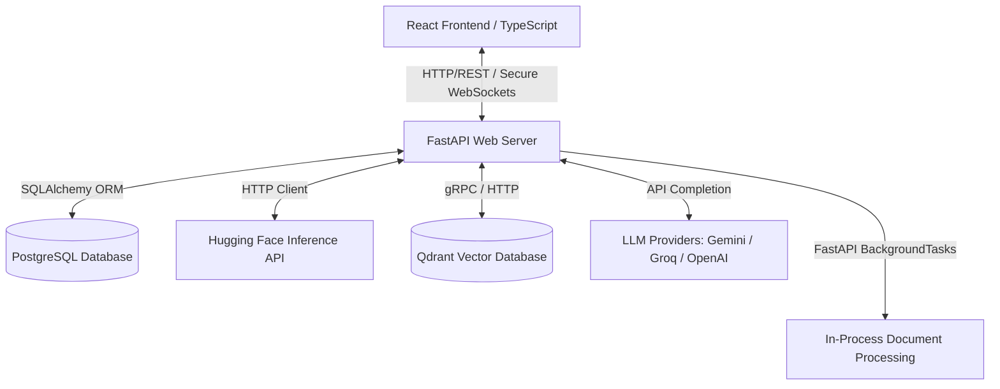
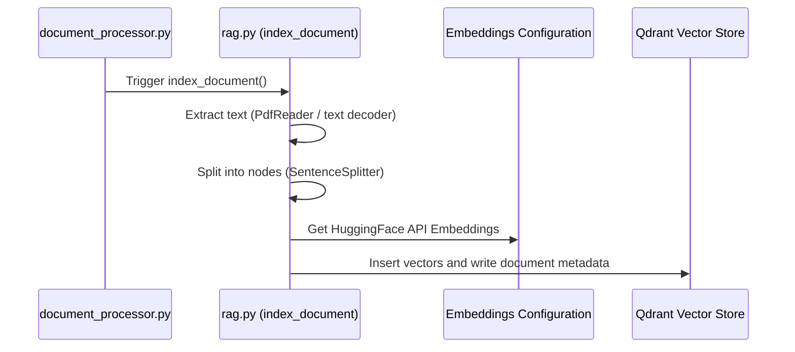
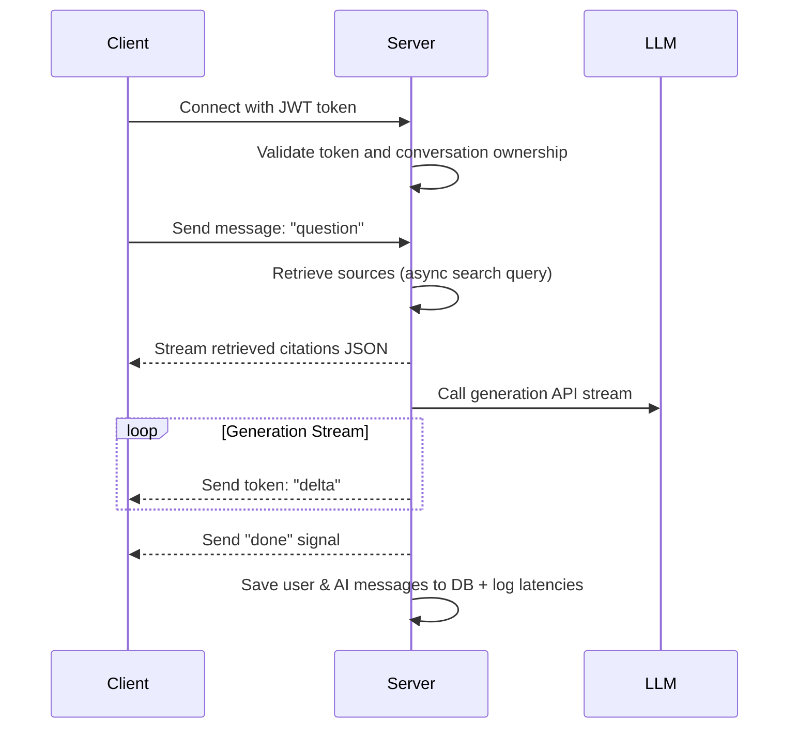

# 🧠 RAG Document QA System — Knowledge Hub AI Assistant

A production-grade, enterprise-scale SaaS application designed for document ingestion, asynchronous vector embedding indexing, and grounded Retrieval-Augmented Generation (RAG) chat. Users can upload documents (PDF and TXT), view real-time ingestion status and system performance telemetry on a dashboard, and chat with an AI support agent that generates grounded responses complete with exact document page-level citations.

---

## 🏗️ 1. High-Level System Architecture

The project features a decoupled, multi-service setup optimized for local development and containerized service bindings:



### Infrastructure Components
- **Frontend Container**: Serving a Vite-built Single Page Application (SPA) on port `5173`.
- **Backend Container**: Running FastAPI using Uvicorn on port `8000`.
- **Relational DB**: PostgreSQL container hosting document index records, user records, messages, and analytical latency logs.
- **Vector DB**: Qdrant Vector Store database container holding chunked text vectors.

---

## 🐍 2. Backend Architecture

The backend is built with **FastAPI** (`app.main:app`), prioritizing speed, automatic documentation via OpenAPI, and async connection management.

### 2.1 Database Schema & Core Models
The project uses SQLAlchemy to map database tables to Python objects:
*   [User](file:///d:/Projects/knowledge-hub-ai-assistant/backend/app/models/user.py): Defines user entities, handling passwords via bcrypt hashing. Supports `ADMIN` and `SUPPORT_AGENT` roles.
*   [Document](file:///d:/Projects/knowledge-hub-ai-assistant/backend/app/models/document.py): Manages document metadata records (filenames, upload paths, parsing status: `UPLOADED`, `PROCESSING`, `INDEXED`, `FAILED`, file type, page and chunk counts).
*   [ProcessingJob](file:///d:/Projects/knowledge-hub-ai-assistant/backend/app/models/job.py): Tracks background document ingestion status, timestamps, and error traces.
*   [Conversation](file:///d:/Projects/knowledge-hub-ai-assistant/backend/app/models/conversation.py): Maps unique chat workspaces to users.
*   [Message](file:///d:/Projects/knowledge-hub-ai-assistant/backend/app/models/message.py): Stores individual messages per conversation with role mapping (`USER`, `ASSISTANT`) and JSON serialized citation sources.
*   [RetrievalLog & AIResponseLog](file:///d:/Projects/knowledge-hub-ai-assistant/backend/app/models/logs.py): Tracks performance telemetry (database query latency, LLM generation time, token counts).

### 2.2 Security & Authentication
- **Hashing**: Leverages `passlib` (using bcrypt algorithm) to secure password inputs.
- **JWT Authentication**: Encodes session credentials into JSON Web Tokens via `python-jose` for secure stateless REST requests and WebSocket queries.
- **Router Dependencies**: Uses [deps.py](file:///d:/Projects/knowledge-hub-ai-assistant/backend/app/api/deps.py) to authenticate clients. `get_current_user` extracts JWT claims, while `get_current_active_admin` restricts upload/admin tools to administrator accounts.

### 2.3 Lightweight In-Process Processing
To run reliably under Render's Free Tier constraints (512MB RAM limit), the project avoids heavy message queues like Celery/RabbitMQ:
1. **REST File Upload**: Files are uploaded to `api/documents/upload` in 1MB chunks (20MB maximum size limit) and stored locally in the [storage/](file:///d:/Projects/knowledge-hub-ai-assistant/backend/storage) volume directory.
2. **FastAPI BackgroundTasks**: Relies on FastAPI's native `BackgroundTasks` thread pool via [document_processor.py](file:///d:/Projects/knowledge-hub-ai-assistant/backend/app/services/document_processor.py) to parse and index document text asynchronously without blocking active REST API requests.

---

## 🔍 3. Retrieval-Augmented Generation (RAG) Service

The RAG logic is orchestrated by LlamaIndex, encapsulated inside [rag.py](file:///d:/Projects/knowledge-hub-ai-assistant/backend/app/services/rag.py).

### 3.1 Document Ingestion Flow


1. **Text Extraction**: Uses `pypdf`'s `PdfReader` to extract content from PDFs page-by-page, appending page number metadata. TXT files are processed as a single block.
2. **Chunk splitting**: LlamaIndex's `SentenceSplitter` segments pages into overlaps (`chunk_size=512`, `chunk_overlap=64` by default) to preserve semantic boundaries.
3. **Cloud Embeddings**: To prevent local model compilation memory spikes (>1GB RAM for PyTorch/transformers libraries), the service routes embeddings through Hugging Face's serverless Inference API (`BAAI/bge-small-en-v1.5` model, 384 dimensions) using the user's `HF_API_KEY`.
4. **Vector Database Indexing**: Chunks are wrapped as LlamaIndex nodes and indexed into Qdrant using the `QdrantVectorStore` client wrapper.

### 3.2 Async Retrieval & Event Loop Fix
*   **The Conflict**: Uvicorn runs FastAPI on a single async event loop. Calling synchronous RAG operations (e.g. `retriever.retrieve()`) causes LlamaIndex to invoke synchronous-to-asynchronous bridge methods (`asyncio.run()`), crashing with `RuntimeError: this event loop is already running`.
*   **The Solution**: Refactored the context retrieval pipeline to be fully async using LlamaIndex's asynchronous retriever APIs:
    *   `retrieve_context` signature changed to `async def retrieve_context(...)`.
    *   Replaced `retriever.retrieve(query)` with `await retriever.aretrieve(query)`.
    *   Passed an initialized `AsyncQdrantClient` under the `aclient` parameter inside the `QdrantVectorStore` constructor:
        ```python
        vector_store = QdrantVectorStore(
            client=qdrant_client_instance,
            aclient=async_qdrant_client_instance,
            collection_name=collection_name
        )
        ```

### 3.3 Prompt Grounding & Greeting Bypass
*   **Greeting Check**: Before triggering vector search, the query is checked against common greetings ("hi", "hello", etc.). If matched, context retrieval is skipped, saving latency and API credits.
*   **Grounded Prompts**: [build_prompts](file:///d:/Projects/knowledge-hub-ai-assistant/backend/app/services/rag.py#L346-L367) inserts retrieved snippets into a system prompt instructing the LLM to answer using **only** the provided documentation context. It returns `"I could not find this information in the uploaded documentation."` if no relevant chunks are found, mitigating hallucinations.

---

## ⚡ 4. Real-time WebSocket Streaming

The WebSocket chat endpoint at `/api/ws/chat/{conversation_id}` handles user interactions, citation streaming, and model response generation:



- **Authentication**: Verifies the JWT signature passed via query parameters on WebSocket establishment.
- **Source Streaming**: First, retrieves context chunks asynchronously, sending citations (document title, page number, similarity score, chunk text snippet) to the client as a JSON payload (`"type": "sources"`) before generation starts.
- **Token Streaming**: Initiates `llm.stream_chat(messages)` to receive generator chunks. Each text token is streamed immediately over the socket (`"type": "token"`), providing a responsive user experience.
- **Logging**: Captures generation metrics (generation time, model signature) and persists them in the database.

---

## ⚛️ 5. Frontend Architecture

The frontend is structured in Vite + React + TypeScript, leveraging Tailwind CSS for custom glassmorphism styling.

### 5.1 Key Components
*   [App.tsx](file:///d:/Projects/knowledge-hub-ai-assistant/frontend/src/App.tsx): Main layout shell containing responsive tab switches, sidebars, and authenticated session handlers.
*   [Login.tsx](file:///d:/Projects/knowledge-hub-ai-assistant/frontend/src/components/auth/Login.tsx): Floating glass panel login interface containing error boundaries and loading indicators.
*   [Dashboard.tsx](file:///d:/Projects/knowledge-hub-ai-assistant/frontend/src/components/dashboard/Dashboard.tsx): Displays overall metrics (total documents, total chunks, average latency) and a table of background document processing jobs.
*   [DocumentManager.tsx](file:///d:/Projects/knowledge-hub-ai-assistant/frontend/src/components/documents/DocumentManager.tsx): Drag-and-drop workspace supporting PDF/TXT uploads, size checks (20MB limit), and file deletes.
*   [ChatWindow.tsx](file:///d:/Projects/knowledge-hub-ai-assistant/frontend/src/components/chat/ChatWindow.tsx): Real-time chat client executing secure WebSocket handshakes. Features:
    *   **Instant Streaming States**: Locks text submission and displays typing indicators immediately upon sending to prevent duplicate queries.
    *   **Interactive Citations**: Renders clickable citation tags below response messages. Clicking tags opens a details inspector panel highlighting the matching excerpt and page location.

---

## 📱 6. Mobile Optimization

The user interface is optimized for smaller viewports (phones and tablets):
- **Address Bar Fix**: Implemented `h-[100dvh]` on layout wrappers to prevent mobile browser navigation panels from clipping bottom controls.
- **Adaptive Layout**: Sidebars auto-collapse on mobile viewports. Layout flows swap into column wraps, and table cells utilize compact sizing.
- **iOS Bottom Tab Bar**: Renders a premium bottom navigation bar on mobile for tab navigation.
- **Scrollable Modal Citations**: citation overlays are bound to `max-h-[90vh]` and made scrollable, ensuring full readability on low-resolution displays.

---

## 🚀 7. Running the Application Locally

The infrastructure (PostgreSQL, Qdrant) is fully containerized under Docker Compose, while application servers run locally on the host to support hot-reloading.

### 7.1 Prerequisites
Ensure you have Docker, Python 3.12+, and Node.js 20+ installed.

### 7.2 Start Infrastructure Containers
In the root directory, spin up PostgreSQL and Qdrant:
```bash
docker compose up db qdrant -d
```

### 7.3 Launch Backend API Server
Navigate to the backend directory, install python dependencies, and launch Uvicorn:
```bash
cd backend
pip install -r requirements.txt
uvicorn app.main:app --reload
```
The server will start on `http://localhost:8000`.

### 7.4 Launch React Frontend Client
Open a second terminal window, navigate to the frontend directory, install npm packages, and start the development server:
```bash
cd frontend
npm install
npm run dev
```
The client will start on `http://localhost:5173`.

---

## 🔑 8. Developer Credentials

Use the following seeded accounts to log in and test the permissions system:

*   **System Administrator (Access to Dashboard, Document Manager, & Chat):**
    *   **Email:** `admin@company.com`
    *   **Password:** `adminpassword`
*   **Support Agent (Access to AI Chat only):**
    *   **Email:** `agent@company.com`
    *   **Password:** `agentpassword`
