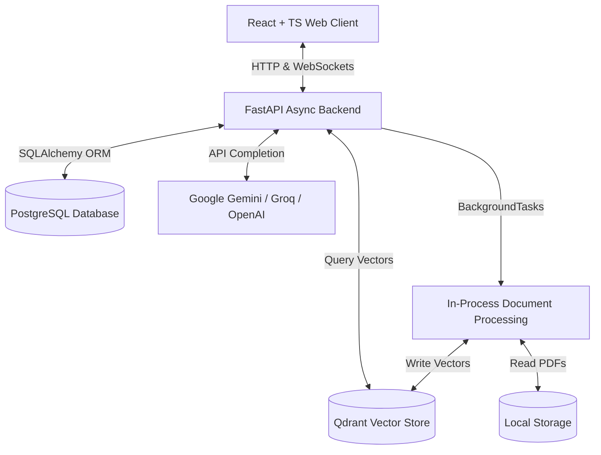

# 🧠 RAG Document QA System — Knowledge Hub AI Assistant

A production-grade, enterprise-scale SaaS application designed for document ingestion, asynchronous vector embedding indexing, and grounded Retrieval-Augmented Generation (RAG) chat. Users can upload documents (PDF and TXT), view real-time ingestion status and system performance telemetry on a dashboard, and chat with an AI support agent that generates grounded responses complete with exact document page-level citations.

---

## 🏗️ Architecture & Technical Stack

The project features a decoupled, multi-service setup optimized for local development and containerized service bindings:



### Backend (Python & FastAPI)
*   **FastAPI:** Asynchronous web framework handling REST endpoints and real-time streaming over state-aware WebSocket connections (`/api/ws/chat/{conversation_id}`).
*   **SQLAlchemy ORM:** Relational database integration mapping tables for users, documents, processing jobs, chat messages, and performance telemetry.
*   **Alembic:** Handles relational database migrations.

### Ingestion & RAG Orchestration (LlamaIndex & BackgroundTasks)
*   **FastAPI BackgroundTasks:** Replaced heavy Celery/Redis infrastructure with lightweight, in-process async background workers to split and embed files, allowing stable execution under 512MB RAM constraints (e.g. Render Free Tier).
*   **LlamaIndex:** Framework orchestration for parsing, chunking, indexing, and retrieval.
*   **Hugging Face Inference API Embeddings:** Generates vector representations using BAAI/bge-small-en-v1.5 (384-dimensional cosine similarity vectors) via Hugging Face Cloud Inference API to bypass heavy local PyTorch dependencies and minimize RAM footprint.
*   **Qdrant:** Vector Database storing the vectorized chunks and associated metadata (e.g., document ID, page number, original text).
*   **Async Event Loop Resolution:** Implemented async retrieval (`retriever.aretrieve`) and integrated `AsyncQdrantClient` within the vector store pool to prevent event loop crashes in production.

### Large Language Model (LLM Providers)
*   **LLM Providers:** Supports Google Gemini (`models/gemini-1.5-flash`), OpenAI (`gpt-4o-mini`), Groq (`llama-3.3-70b-versatile`), or Ollama for local testing.
*   **Grounded Prompts:** Strict system constraints prevent model hallucinations. It only uses retrieved vector chunks and falls back to a standardized refusal if context is missing.
*   **Deterministic Configuration:** Evaluates using `temperature=0.0` to guarantee factual accuracy and prevent text-completion loops.
*   **Greeting Bypass:** Instantly resolves common conversational greetings (e.g., *"hi"*, *"hello"*) without executing vector queries, saving response latency and API credits.

### Frontend (React & TypeScript)
*   **Vite + React + TypeScript:** Highly responsive UI structure compiled cleanly with strict type bindings.
*   **Tailwind CSS:** Styled with a premium glassmorphic dark-and-light-theme design.
*   **Dynamic Views:**
    *   **Metrics Dashboard:** Displays KPI statistics (total documents, total chunks, average latency) and a table of background document processing jobs.
    *   **Document Manager:** Drag-and-drop workspace that supports file uploading (up to 20MB), page/chunk parsing, and vector deletion actions.
    *   **AI Support Chat:** Multi-session chat interface with token-by-token text streaming and interactive source citations.

---

## 🗄️ Database Schema & Entities

The system maintains a clean relational mapping in PostgreSQL:

1.  **User (`users`):** Stores credentials, roles (`ADMIN` or `SUPPORT_AGENT`), and timestamps.
2.  **Document (`documents`):** Contains uploaded file paths, metadata, page counts, chunk metrics, and status (`UPLOADED`, `PROCESSING`, `INDEXED`, `FAILED`).
3.  **ProcessingJob (`processing_jobs`):** Tracks background ingestion tasks, execution timestamps, and parsing errors.
4.  **Conversation (`conversations`):** Organizes user chat sessions.
5.  **Message (`messages`):** Holds chat messages, roles (`USER` / `ASSISTANT`), content text, and a JSONB list of cited vector sources.
6.  **RetrievalLog & AIResponseLog (`retrieval_logs`, `ai_response_logs`):** Stores performance telemetry (database query latency, LLM generation time, token counts).

---

## 🚀 Running the Application Locally

The infrastructure (PostgreSQL, Qdrant) is fully containerized under Docker Compose, while application servers run locally on the host to support hot-reloading.

### 1. Prerequisites
Ensure you have Docker, Python 3.12+, and Node.js 20+ installed.

### 2. Start Infrastructure Containers
In the root directory, spin up PostgreSQL and Qdrant:
```bash
docker compose up db qdrant -d
```

### 3. Launch Backend API Server
Navigate to the backend directory, install python dependencies, and launch Uvicorn:
```bash
cd backend
pip install -r requirements.txt
uvicorn app.main:app --reload
```
The server will start on `http://localhost:8000`.

### 4. Launch React Frontend Client
Open a second terminal window, navigate to the frontend directory, install npm packages, and start the development server:
```bash
cd frontend
npm install
npm run dev
```
The client will start on `http://localhost:5173`.

---

## 🔑 Developer Credentials

Use the following seeded accounts to log in and test the permissions system:

*   **System Administrator (Access to Dashboard, Document Manager, & Chat):**
    *   **Email:** `admin@company.com`
    *   **Password:** `adminpassword`
*   **Support Agent (Access to AI Chat only):**
    *   **Email:** `agent@company.com`
    *   **Password:** `agentpassword`

